# **ПОШАГОВЫЙ ПЛАН ВЫЧИСЛЕНИЙ И АЛГОРИТМЫ С ДИАГРАММАМИ Mermaid**

## **ОБЩАЯ БЛОК-СХЕМА СИСТЕМЫ**

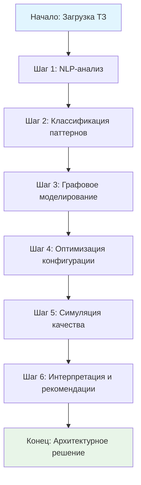

---

## **ШАГ 1: NLP-АНАЛИЗ ТЗ - ДЕТАЛЬНАЯ БЛОК-СХЕМА**

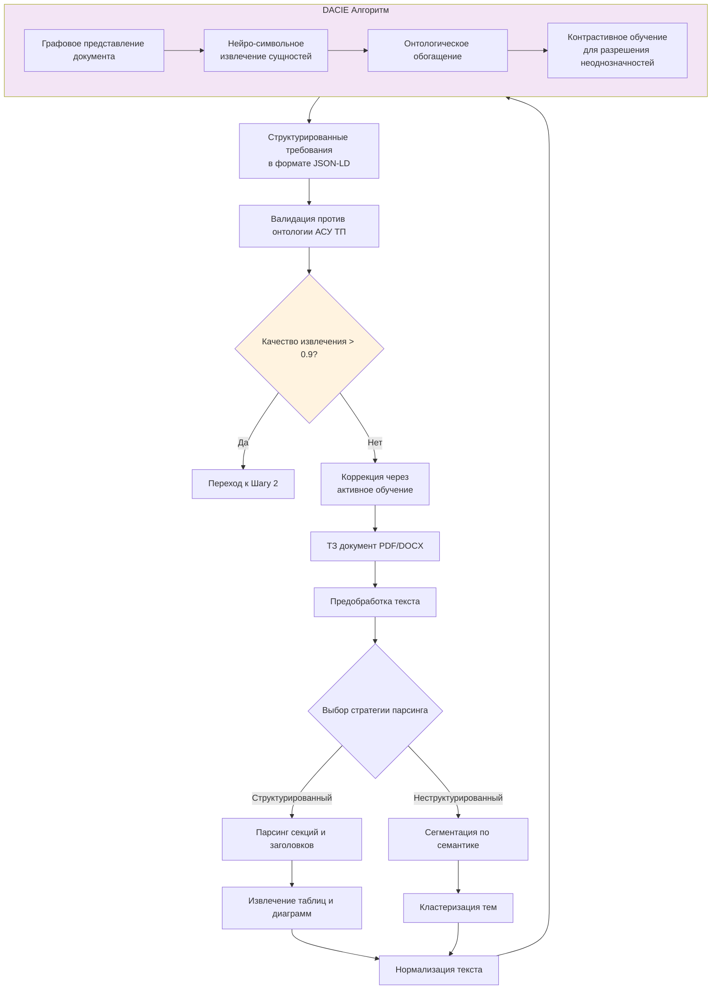

### **Алгоритм 1.1: DACIE - Извлечение сущностей**
```python
def dacie_entity_extraction(document_text, ontology):
    """
    Domain-Adaptive Compositional Information Extractor
    """
    # 1. Графовое представление документа
    doc_graph = build_document_graph(document_text)
    
    # 2. Нейронный компонент: кодирование
    neural_embeddings = neural_encoder(doc_graph)
    
    # 3. Символьный компонент: применение правил
    symbolic_features = apply_domain_rules(doc_graph, ontology)
    
    # 4. Композиционное объединение
    for node in doc_graph.nodes:
        # 4.1. Взвешивание источников
        gate = compute_gate(neural_embeddings[node], symbolic_features[node])
        
        # 4.2. Остаточное соединение
        combined = gate * neural_embeddings[node] + \
                  (1 - gate) * symbolic_features[node]
        
        # 4.3. Контрастивное обучение
        if is_ambiguous(node):
            hard_negatives = generate_hard_negatives(node, ontology)
            loss = contrastive_loss(combined, hard_negatives)
            update_weights(loss)
    
    # 5. Извлечение сущностей
    entities = extract_from_combined_representation(doc_graph)
    
    return entities
```

### **Диаграмма последовательности Шага 1**

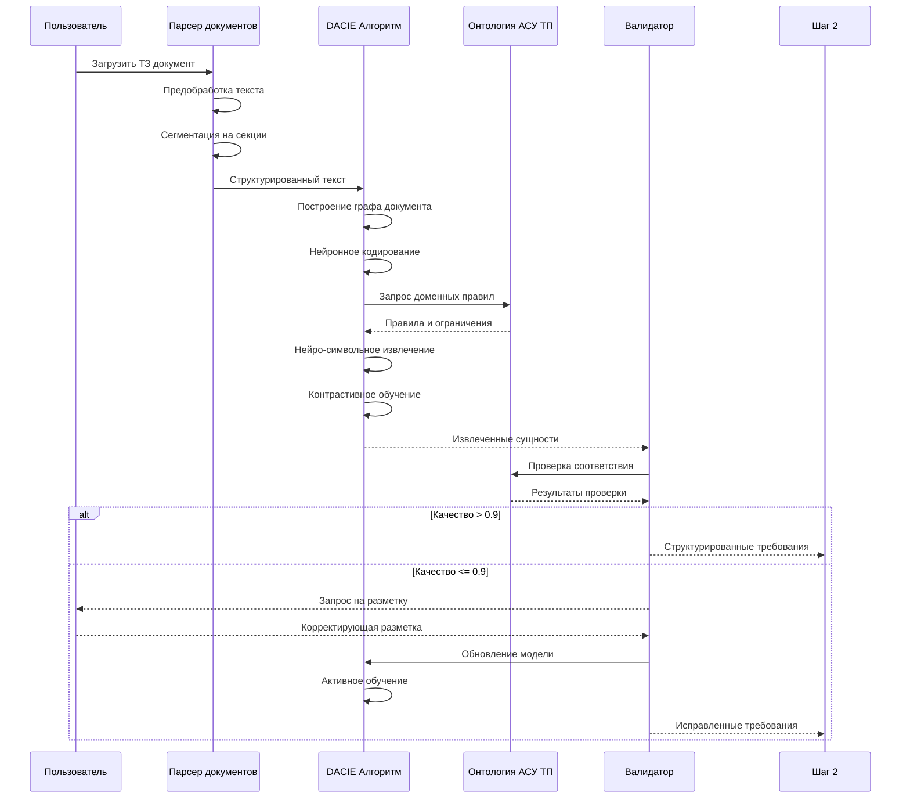

---

## **ШАГ 2: КЛАССИФИКАЦИЯ ПАТТЕРНОВ - ДЕТАЛЬНАЯ БЛОК-СХЕМА**

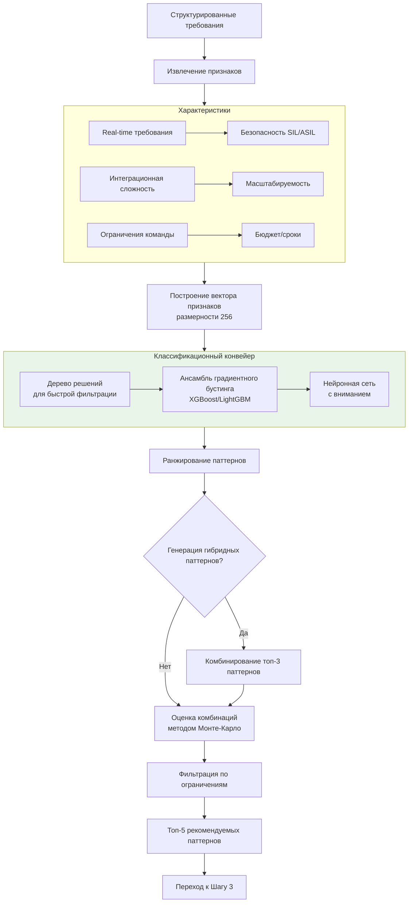

### **Алгоритм 2.1: Многоуровневая классификация паттернов**
```python
def multi_level_pattern_classification(feature_vector, constraints):
    """
    Трехуровневый классификационный конвейер
    """
    patterns = []
    
    # Уровень 1: Быстрая фильтрация (дерево решений)
    candidate_patterns = level1_decision_tree(feature_vector)
    
    # Уровень 2: Точная классификация (градиентный бустинг)
    for pattern in candidate_patterns:
        # 2.1. Извлечение доменно-специфичных признаков
        domain_features = extract_domain_features(pattern, feature_vector)
        
        # 2.2. Ансамблевая классификация
        ensemble_prediction = gradient_boosting_ensemble(domain_features)
        
        # 2.3. Калибровка уверенности
        calibrated_confidence = calibrate_confidence(ensemble_prediction)
        
        if calibrated_confidence > 0.7:
            patterns.append({
                'pattern': pattern,
                'confidence': calibrated_confidence,
                'features': domain_features
            })
    
    # Уровень 3: Нейронная дооценка с вниманием
    ranked_patterns = []
    for item in patterns:
        # 3.1. Внимание к ключевым требованиям
        attention_weights = compute_attention(
            item['features'], 
            constraints['critical_requirements']
        )
        
        # 3.2. Нейронное переранжирование
        final_score = neural_reranking(item, attention_weights)
        
        ranked_patterns.append({
            **item,
            'final_score': final_score,
            'attention_weights': attention_weights
        })
    
    # Сортировка по итоговому score
    ranked_patterns.sort(key=lambda x: x['final_score'], reverse=True)
    
    return ranked_patterns[:5]  # Топ-5 паттернов
```

### **Диаграмма последовательности Шага 2**

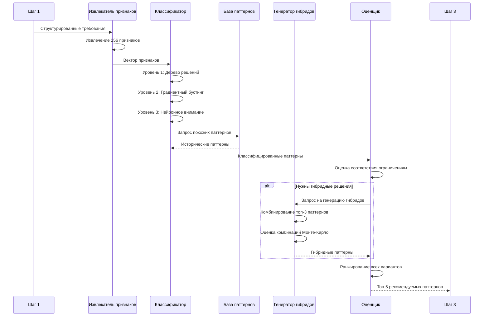

---

## **ШАГ 3: ГРАФОВОЕ МОДЕЛИРОВАНИЕ - ДЕТАЛЬНАЯ БЛОК-СХЕМА**

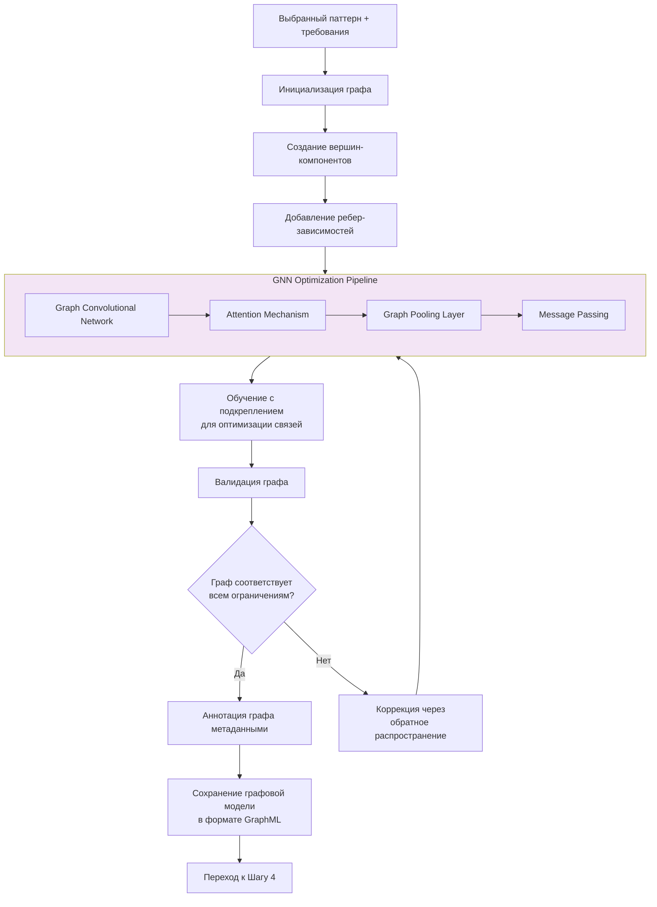

### **Алгоритм 3.1: GNN-оптимизация графа архитектуры**
```python
def gnn_architecture_optimization(initial_graph, requirements):
    """
    Графовая нейронная сеть для оптимизации архитектуры
    """
    # Инициализация GNN
    gnn = GraphNeuralNetwork(
        in_channels=initial_graph.node_features_dim,
        hidden_channels=128,
        out_channels=64,
        num_layers=3
    )
    
    # Обучение с подкреплением для оптимизации
    for epoch in range(100):
        # 1. Прямое распространение в GNN
        node_embeddings = gnn(initial_graph.x, initial_graph.edge_index)
        
        # 2. Вычисление reward-функции
        rewards = compute_rewards(
            node_embeddings, 
            initial_graph, 
            requirements
        )
        
        # 3. Policy Gradient обновление
        if epoch % 10 == 0:
            # 3.1. Поиск оптимальной конфигурации
            optimal_config = find_optimal_configuration(
                node_embeddings, 
                method='beam_search'
            )
            
            # 3.2. Вычисление преимуществ
            advantages = compute_advantages(rewards, optimal_config)
            
            # 3.3. Обновление политики
            gnn.update_policy(advantages)
        
        # 4. Динамическое изменение графа
        if should_restructure_graph(initial_graph, rewards):
            initial_graph = restructure_graph(
                initial_graph, 
                node_embeddings
            )
    
    # Финальная оптимизация
    optimized_graph = apply_final_optimization(initial_graph)
    
    return optimized_graph
```

### **Диаграмма последовательности Шага 3**

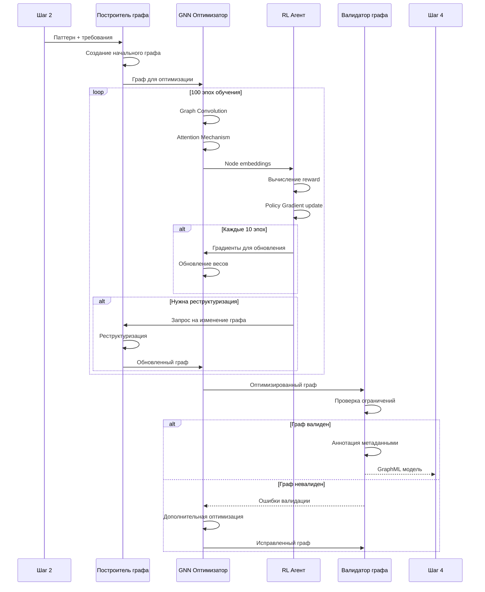

---

## **ШАГ 4: ОПТИМИЗАЦИЯ КОНФИГУРАЦИИ - ДЕТАЛЬНАЯ БЛОК-СХЕМА**

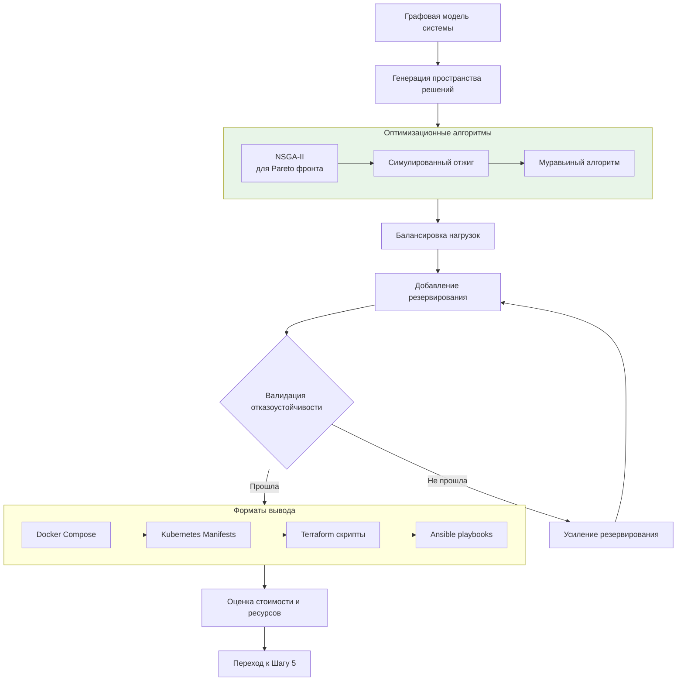

### **Алгоритм 4.1: Многокритериальная оптимизация NSGA-II**
```python
def nsga2_architecture_optimization(solution_space, objectives, constraints):
    """
    NSGA-II для многокритериальной оптимизации архитектуры
    """
    # Инициализация популяции
    population = initialize_population(solution_space, size=100)
    
    for generation in range(50):
        # 1. Оценка популяции
        fitness_values = []
        for individual in population:
            # Вычисление всех целевых функций
            fitness = {
                'performance': evaluate_performance(individual),
                'cost': evaluate_cost(individual),
                'reliability': evaluate_reliability(individual),
                'maintainability': evaluate_maintainability(individual)
            }
            
            # Проверка ограничений
            if check_constraints(individual, constraints):
                fitness_values.append(fitness)
            else:
                # Штраф за нарушение ограничений
                fitness_values.append(apply_penalty(fitness))
        
        # 2. Недоминируемая сортировка
        fronts = non_dominated_sort(fitness_values)
        
        # 3. Вычисление crowding distance
        for front in fronts:
            crowding_distance(front, fitness_values)
        
        # 4. Селекция
        selected = selection(population, fronts, size=len(population)//2)
        
        # 5. Кроссовер и мутация
        offspring = []
        for i in range(0, len(selected), 2):
            parent1 = selected[i]
            parent2 = selected[i+1]
            
            # Кроссовер архитектур
            child1, child2 = architectural_crossover(parent1, parent2)
            
            # Мутация
            if random.random() < 0.1:
                child1 = mutate_architecture(child1)
            if random.random() < 0.1:
                child2 = mutate_architecture(child2)
            
            offspring.extend([child1, child2])
        
        # 6. Формирование новой популяции
        population = selected + offspring
    
    # Выбор лучших решений из Pareto фронта
    pareto_front = get_pareto_front(population, fitness_values)
    
    return pareto_front[:3]  # Топ-3 решения
```

### **Диаграмма последовательности Шага 4**

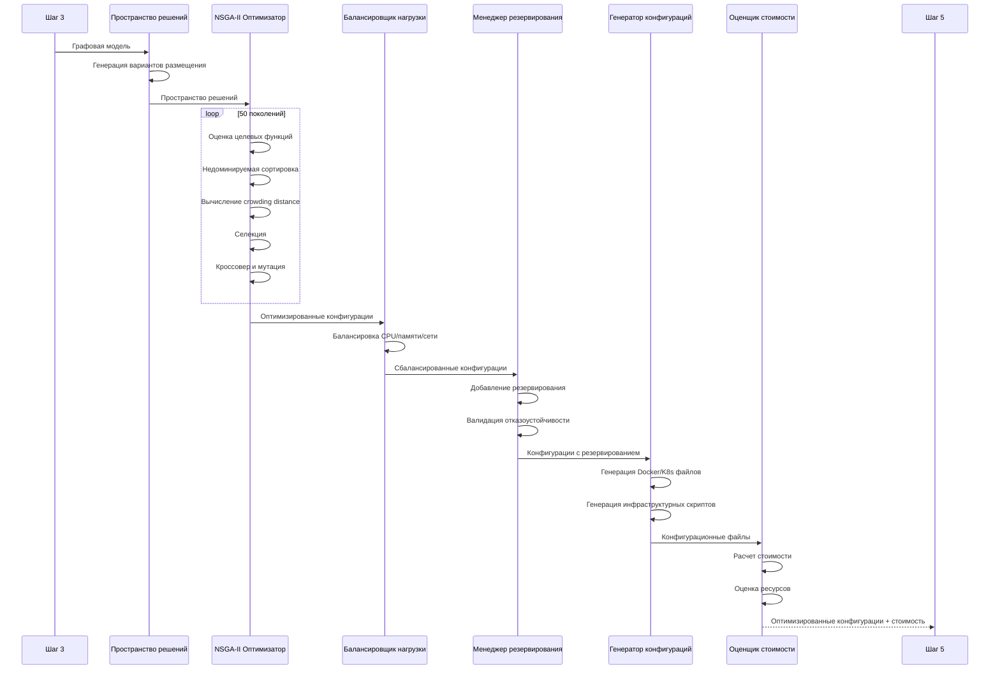

---

## **ШАГ 5: СИМУЛЯЦИЯ КАЧЕСТВА - ДЕТАЛЬНАЯ БЛОК-СХЕМА**

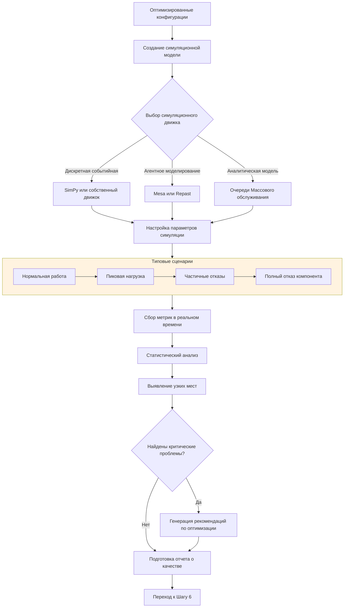

### **Алгоритм 5.1: Дискретно-событийная симуляция**
```python
def discrete_event_simulation(configuration, scenarios):
    """
    Дискретно-событийная симуляция архитектуры АСУ ТП
    """
    class ASU_TP_Simulation:
        def __init__(self, config):
            self.env = simpy.Environment()
            self.config = config
            self.metrics = defaultdict(list)
            
            # Инициализация компонентов
            self.init_components()
            
            # Инициализация мониторов
            self.init_monitors()
        
        def init_components(self):
            """Создание симуляционных моделей компонентов"""
            self.components = {}
            for comp in self.config['components']:
                if comp['type'] == 'sensor':
                    self.components[comp['id']] = SensorModel(
                        env=self.env, 
                        config=comp
                    )
                elif comp['type'] == 'controller':
                    self.components[comp['id']] = ControllerModel(
                        env=self.env, 
                        config=comp
                    )
                # ... другие типы компонентов
        
        def run_scenario(self, scenario, duration):
            """Запуск сценария симуляции"""
            # Запуск процессов
            for process in scenario['processes']:
                self.env.process(self.execute_process(process))
            
            # Запуск мониторинга
            self.env.process(self.monitor_metrics())
            
            # Запуск сбоев (если есть)
            if 'failures' in scenario:
                for failure in scenario['failures']:
                    self.env.process(self.inject_failure(failure))
            
            # Запуск симуляции
            self.env.run(until=duration)
            
            return self.collect_results()
        
        def execute_process(self, process):
            """Выполнение бизнес-процесса"""
            while True:
                # Генерация событий согласно процессу
                yield self.env.timeout(process['interval'])
                
                # Обработка события
                start_time = self.env.now
                
                # Прохождение через компоненты
                for step in process['steps']:
                    component = self.components[step['component']]
                    yield component.process(step['data'])
                
                # Запись метрик
                processing_time = self.env.now - start_time
                self.metrics['processing_times'].append(processing_time)
    
    # Запуск симуляции для всех сценариев
    results = {}
    for scenario_name, scenario_config in scenarios.items():
        sim = ASU_TP_Simulation(configuration)
        scenario_results = sim.run_scenario(
            scenario_config, 
            duration=scenario_config['duration']
        )
        results[scenario_name] = scenario_results
    
    return results
```

### **Диаграмма последовательности Шага 5**

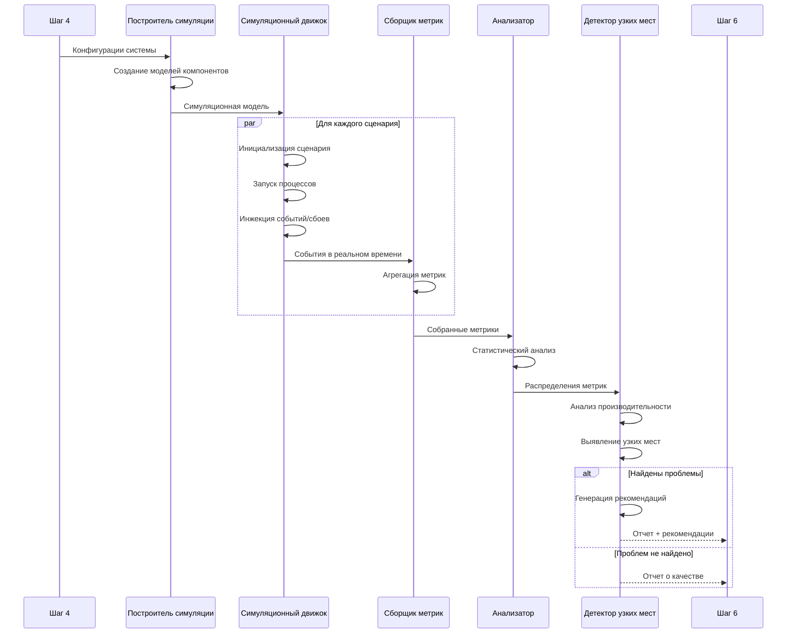

---

## **ШАГ 6: ИНТЕРПРЕТАЦИЯ И РЕКОМЕНДАЦИИ - ДЕТАЛЬНАЯ БЛОК-СХЕМА**

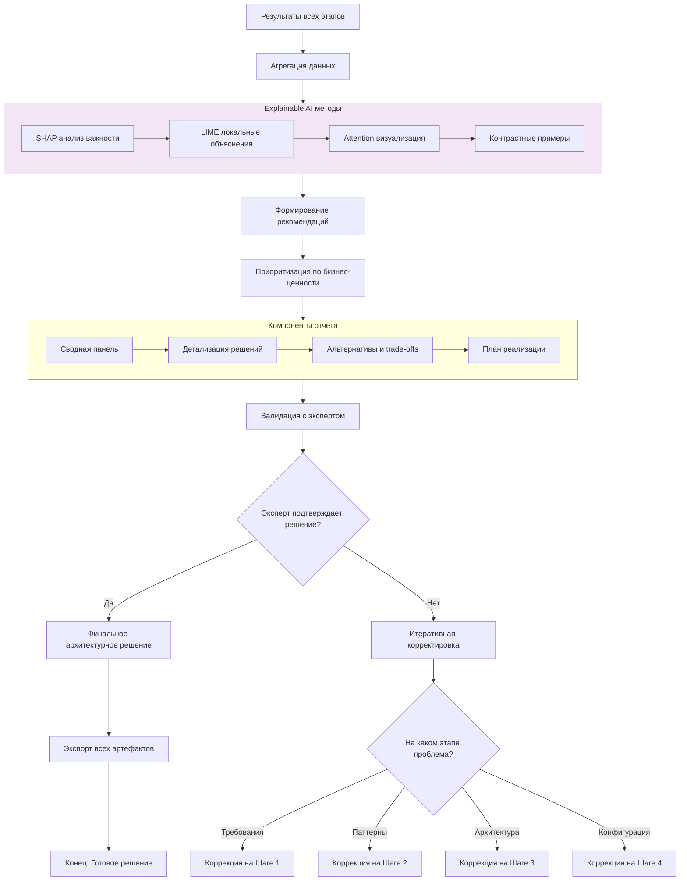

### **Алгоритм 6.1: Генерация объяснимых рекомендаций**
```python
def generate_explainable_recommendations(all_steps_data, simulation_results):
    """
    Генерация объяснимых рекомендаций с использованием XAI
    """
    recommendations = {
        'summary': {},
        'detailed_recommendations': [],
        'explanations': {},
        'alternatives': [],
        'implementation_plan': {}
    }
    
    # 1. SHAP анализ для важности решений
    shap_values = compute_shap_values(all_steps_data)
    recommendations['explanations']['feature_importance'] = shap_values
    
    # 2. Генерация контрастных примеров
    contrastive_examples = generate_contrastive_examples(
        all_steps_data['final_decision'],
        all_steps_data['alternative_decisions']
    )
    recommendations['explanations']['contrastive'] = contrastive_examples
    
    # 3. Локальные объяснения LIME
    for key_decision in all_steps_data['key_decisions']:
        lime_explanation = lime_explain(
            decision=key_decision,
            data=all_steps_data,
            num_features=10
        )
        recommendations['explanations']['local'][key_decision['id']] = \
            lime_explanation
    
    # 4. Формирование рекомендаций на основе объяснений
    recommendations['detailed_recommendations'] = formulate_recommendations(
        all_steps_data, 
        recommendations['explanations']
    )
    
    # 5. Приоритизация по бизнес-ценности
    prioritized_recommendations = prioritize_by_business_value(
        recommendations['detailed_recommendations'],
        business_objectives=all_steps_data['business_objectives']
    )
    
    # 6. Создание плана реализации
    implementation_plan = create_implementation_plan(
        prioritized_recommendations,
        team_capabilities=all_steps_data['team_info']
    )
    
    recommendations['implementation_plan'] = implementation_plan
    
    return recommendations
```

### **Диаграмма последовательности Шага 6**

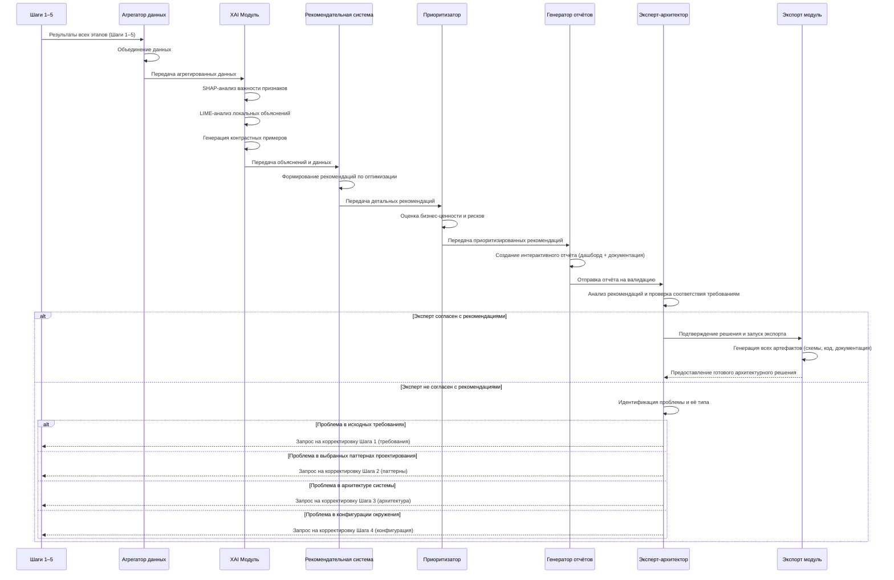

---

## **ПОЛНАЯ ИНТЕГРАЦИОННАЯ ДИАГРАММА**

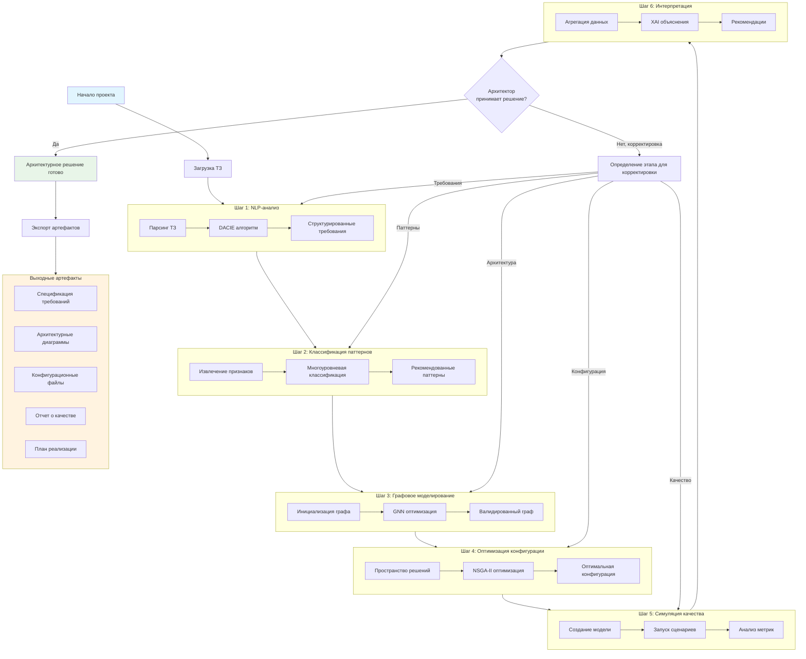

